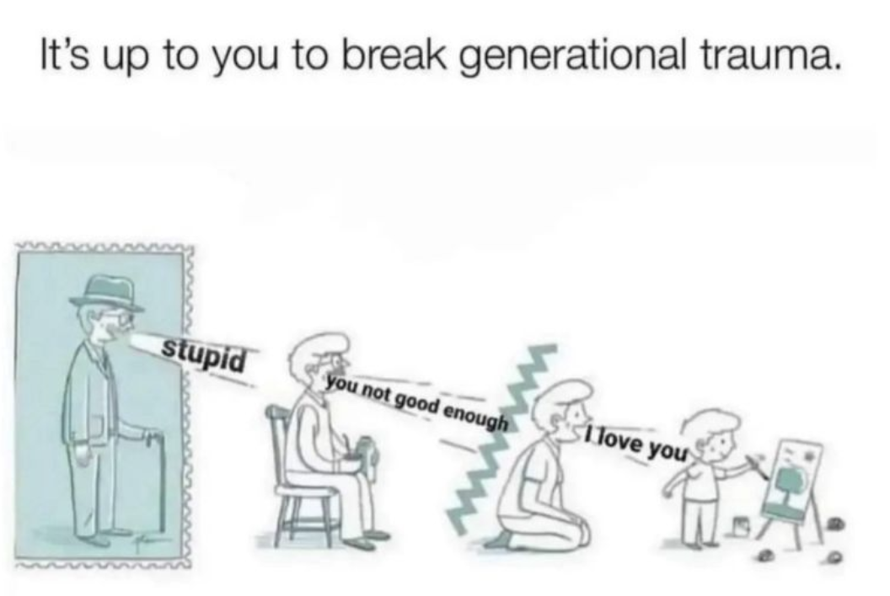

# Intro
These were some books that I found interesting / impactful, feel free to take a look at some if you aren't too busy in college :^)

# Psychology
### Pocket Guide to Interpersonal Neurobiology 10/10
https://www.goodreads.com/book/show/13370433-pocket-guide-to-interpersonal-neurobiology

Transformative book, helped me develop a mental model of how the brain and relationships work that I still use every day. Very dense textbook that dives deep into the anatomy of the brain. An easier read from the same author is The Developing Mind, maybe some of his other books are translated to Chinese.

> In relationships within families, one can see the intergenerational transfer of patterns of communication that are reinforced by the repeated experiences of energy and information flow exchange patterns. Recent discoveries in the field of epigenetics have also revealed that alterations in the control molecules regulating gene expression may also be important in this intergenerational passage of patterns of communication. For example, the experience of extreme stress in one generation may be passed on through gametes, the egg and sperm, such that the ability to regulate stress may be compromised in future generations. 
> If one generation has experienced overwhelming events, like a famine or genocide, it is possible that the children and even grandchildren may have inherited regulatory epigenetic factors that compromise the ability to soothe stress.

### No Bad Parts 7/10 (Concept 10/10)
https://www.goodreads.com/book/show/55384168-no-bad-parts

The writing is kind of dumb and repetitive but I've found it to be a very useful framework for thinking about emotions and relationships. 

> Like children in external families, we each have parts that want things that aren’t good for them or for the rest of the system. The difference here is that the Self says no to impulsive parts firmly but from a place of love and patience, in just the same way an ideal parent would. Additionally, in IFS, when parts do take over, we don’t shame them. Instead, we get curious and use the part’s impulse as a trailhead to find what is driving it that needs to be healed.

### Thinking, Fast and Slow 9/10
https://www.goodreads.com/book/show/11468377-thinking-fast-and-slow

How to think critically and not to be an idiot, by some of the pioneering academics in the field. Extremely interesting read.

### The Willpower Instinct 9/10
https://www.goodreads.com/book/show/10865206-the-willpower-instinct

Very easy and short read but completely packed with useful tips. I don't like most self-help books but this one was legitimately useful.

> Students who were harder on themselves for procrastinating on their first exam were more likely to procrastinate on later exams than students who forgave themselves. The harder they were on themselves about procrastinating the first time, the longer they procrastinated for the next exam! Forgiveness—not guilt—helped them get back on track.

> One reason forgiveness helps people recover from mistakes is that it takes away the shame and pain of thinking about what happened. Without the guilt and self-criticism, there's nothing to escape. This means it's easier to reflect on how the failure happened, and less tempting to repeat it.

# Philosophy
### How to Solve Our Human Problems 8/10
https://www.goodreads.com/book/show/1087501.How_to_Solve_Our_Human_Problems

A lot of the book is primarily Buddhist and may not be initially relevant but a few of the chapters about thinking about anger had a huge impact on how I perceive the world and I highly recommend giving them a skim. ("Learning to Accept Suffering", "The Patience of Definitely Thinking About Dharma")

> Just as we do not choose to suffer from sickness, so the person who beats us does not choose to suffer from the inner sickness of anger. We might think that there is a difference between our sickness and the angry person, in that our sickness has no wish to harm us whereas an enemy most certainly does have this wish. What we must realize, however, is that the person who wishes to harm us does so without freedom; he is completely under the control of his anger. He does not decide, 'Now I will become angry'; anger simply arises and takes over his mind without any choice on his part.
> 
> All things, including our state of mind, are dependent arisings; they do not have an independent or self-existent nature of their own. It is therefore senseless to react with anger to people or situations that have no choice in causing us harm. If we train our mind to see the interdependent nature of all phenomena, we shall be able to eliminate the cause of much of our anger.

### Meditations 9/10
https://www.goodreads.com/book/show/54817586-meditations

One of important works of all time on how to live your life.

> If you are distressed by anything external, the pain is not due to the thing itself, but to your estimate of it; and this you have the power to revoke at any moment.

> A mind free from passions is a citadel. There is nothing more secure that a mind free from passions when seeking refuge and repelling attacks. He who hasn't see this is ignorant, and he who has seen it but does not seek this refuge of the secure mind is unhappy.

# Novels
### Siddhartha 9/10
https://www.goodreads.com/book/show/41817978-Siddhartha

Beautiful and short. I wish I read this when I was younger.

### The Brothers Karamazov 9/10
https://www.goodreads.com/book/show/4934.The_Brothers_Karamazov

By Dostoevsky, said by some to be the greatest book of all time.

> “Above all, don't lie to yourself. The man who lies to himself and listens to his own lie comes to a point that he cannot distinguish the truth within him, or around him, and so loses all respect for himself and for others. And having no respect he ceases to love.”

# Other
### Thinking In Systems 8/10
https://www.goodreads.com/book/show/3828902-thinking-in-systems

Profoundly useful book on applying a systems framework to evaluate the world around us and solve problems: relationships, career, politics, etc.

### Make it Stick: The Science of Successful Learning 8/10
https://www.goodreads.com/book/show/21956680-make-it-stick

A book about how to learn. You probably know a lot of this already?

> Practice that’s spaced out, interleaved with other learning, and varied produces better mastery, longer retention, and more versatility. But these benefits come at a price: when practice is spaced, interleaved, and varied, it requires more effort. You feel the increased effort, but not the benefits the effort produces. Learning feels slower from this kind of practice, and you don’t get the rapid improvements and affirmations you’re accustomed to seeing from massed practice.

### Hunter x Hunter 10/10
Favorite show of all time you should watch : )

